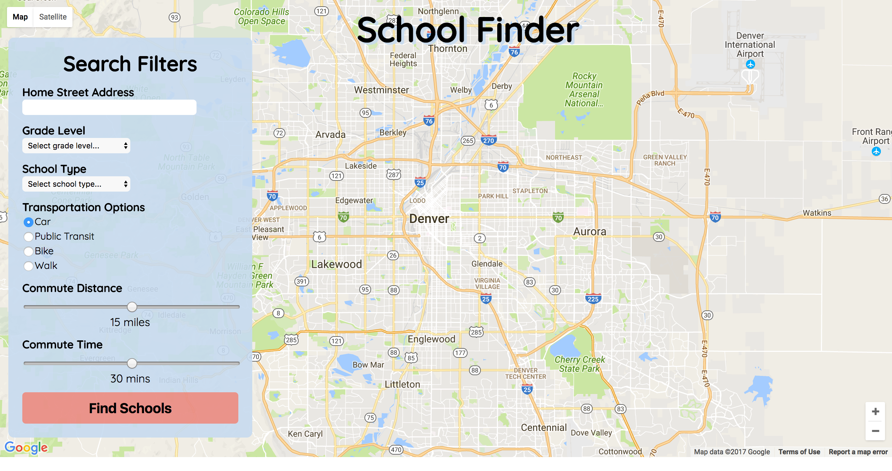
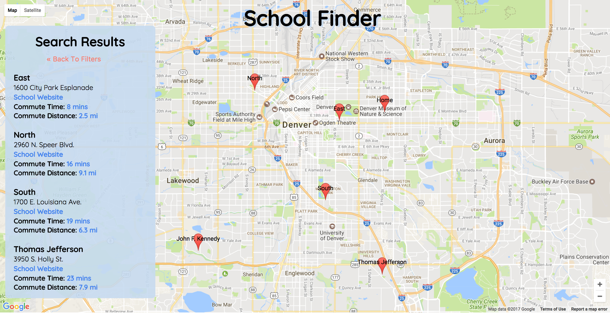
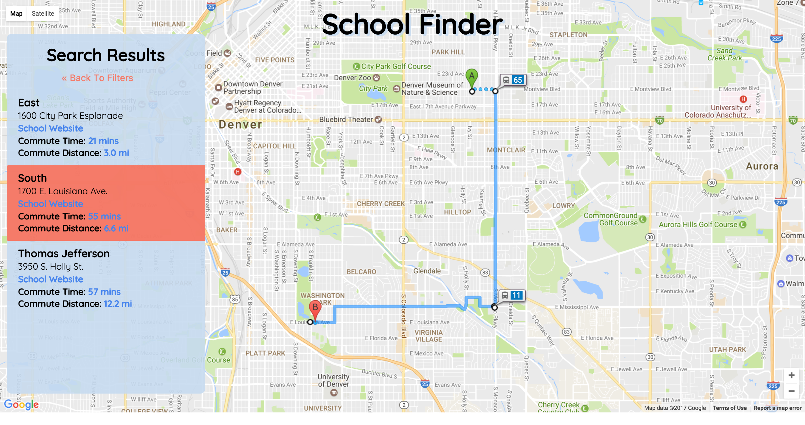

### *Find more info about School Finder 2.0 below*

## School Finder 1.0
This was a one-week, self-directed project at the end of Module 3 at [Turing School of Software & Design](www.turing.io).  
 
I set out to build a React - Redux web application built on top of a Firebase Database and Google Maps APIs that allowed users to quickly and easily search for and get directions to schools within their desired commute parameters for their kids. I am very comfortable with React and Redux and was excited to build a robust application with them that presented data from the internet in a more helpful and productive way for parents.

This project was a great opportunity to continue building my skills in React and Redux while learning a lot about how to implement Google Maps API service.  As a front-end developer, it was also beneficial to spend some time thinking about the database I was building with DPS school data scrubbed from a CSV file downloaded from their website.

The biggest challenge I had was with rendering directions on the page in a React framework.  To solve the problem, I imported a JS library that gave me pre-build components to implement in my code. This ended up being a really great learning opportunity for me and  am excited to continue to explore additional libraries in future projects.

As a former staff member at Teach For America, I care deeply about making sure all children have the opportunity to attain an excellent education and this project reflects my desire to use my skills as a developer and problem solver to ensure that is a reality.

Checkout the app [here](https://school-finder-86e85.firebaseapp.com/).
### Find more info on School Finder 2.0 below.

## Project Screen Shot(s)

## School Finder 2.0 (still being developed)
### A webbased application that uses a public API of Colorado school data (see my [CDoE_data_api](https://github.com/sljohnson32/CDoE_data_api) repo for more info) and Google Map APIs to help Denver parents find great schools for their kids based on commute time and distance.

Checkout the live app [here](https://denver-school-finder.herokuapp.com/). Please note this application is still in development.

## Installation and Setup Instructions

Clone down this repository. You will need `npm` installed globally on your machine.  

Installation:

`npm install`  

To Run Test Suite:

`npm test`

To Start Server:

`nodemon server`

To Start Application for Development:

`cd react-ui && npm start`  

To Visit App:

`localhost:3000/`

## Reflection

This was a team-based, final Capstone project at the end of Module 4 at [Turing School of Software & Design](www.turing.io).  

### Additional Development 
_I worked on developing the 2.0 version of this project with two partners as part of our final Turing Capstone Project.  While we were able to make a number of important additions and improvements to the codebase, the list below represents the remaining issues I will be working on as time allows (also tracked in the issues section of this repo)_

- Styling improvements and better functionality for new Profile and Compare elements
- Format and build out pop-up windows on individual pin clicks
- Refactor lifecycles for smoother transition to display school result pins
- Refactor Google Directions and Distance API calls using Async/Await
- Create admin portal for managing "instances" of the app for specific schoool districts (includes data uploads)
