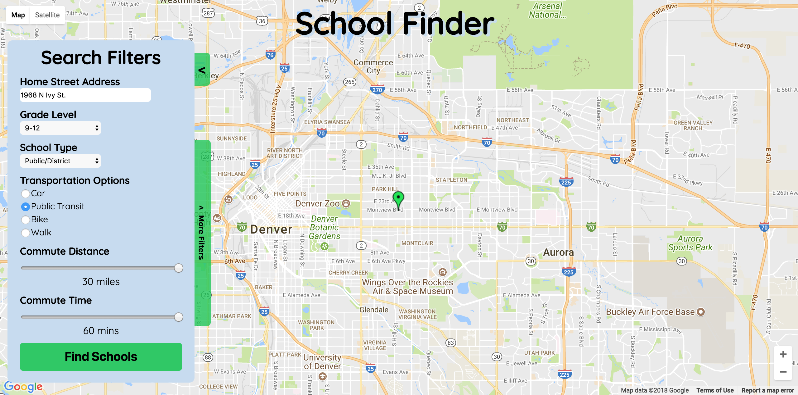
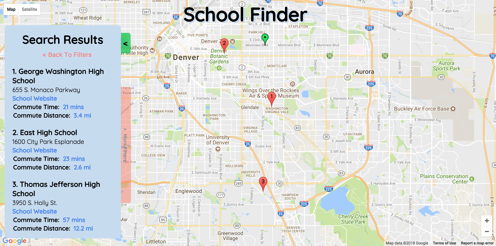
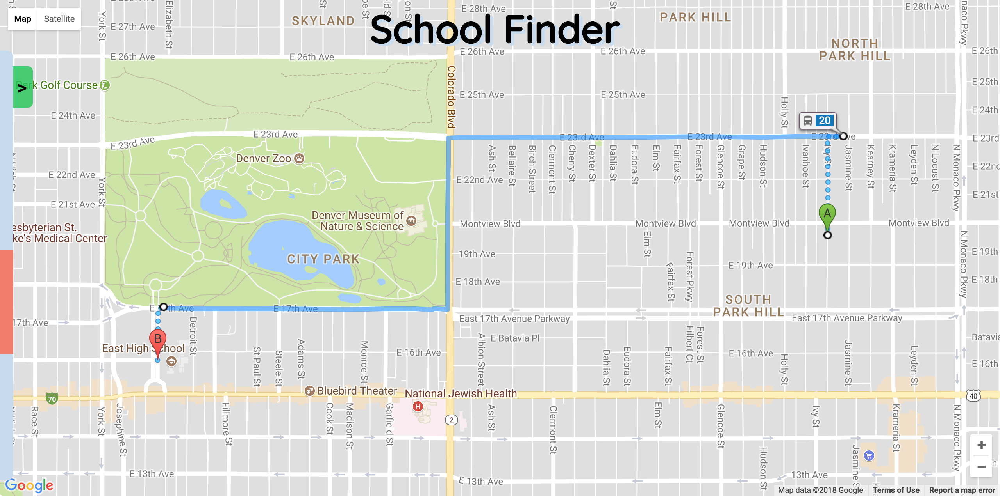

# School Finder
### A webbased application that uses a public API of Colorado school data (see my [CDoE_data_api](https://github.com/sljohnson32/CDoE_data_api) repo for more info) and Google Map APIs to help Denver parents find great schools for their kids based on commute time and distance.

This application began as a self-directed project at the end of Module 3 at [Turing School of Software & Design](www.turing.io). Additional development was done during Module 4 as a team Capstone Project and I continue to work on it as a side project.

I originally set out to build a React - Redux web application built on top of a Firebase Database (now replaced with Node BE) and Google Maps APIs that allowed users to quickly and easily search for and get directions to schools within their desired commute parameters for their kids. I am very comfortable with React and Redux and was excited to build a robust application with them that presented data from the internet in a more helpful and productive way for parents.

As a former staff member at Teach For America, I care deeply about making sure all children have the opportunity to attain an excellent education and this project reflects my desire to use my skills as a developer and problem solver to ensure that becomes a reality one day.

This project has been a great opportunity to continue to hone my skills in React, Redux, and Node while also learning a lot about how to implement Google Maps API services.  As a software developer who has focused more on front-end technologies, I was really excited to have the opportunity to build out two backends in Node w/ Express and Knex to feed the FE application with school-based data and to manage profile information.

Checkout a live version of the app being developed [here](https://denver-school-finder.herokuapp.com/).

## Project Screen Shot(s)

_School search window_ 

_School search results_ 

_Directions displayed after clicking on East High School_ 

## Additional Development
_I worked on developing the 2.0 version of this project with two partners as part of our final Turing Capstone Project.  While we were able to make a number of important additions and improvements to the codebase, the list below represents the remaining enhancements I will be working on as time allows (also tracked in the issues section of this repo)_

- Styling improvements and better functionality for new Profile and Compare elements - these elements are currently not included in production app
- Format and build out pop-up windows on individual pin clicks
- Refactor Google Directions and Distance API calls using Async/Await
- Create admin portal for managing "instances" of the app for specific schoool districts (includes data uploads)

## Installation and Setup Instructions

Clone down this repository. You will need `npm` installed globally on your machine.  

Installation:

`npm install`  

To Start Server:

`nodemon server`

To Start Application for Development:

`cd react-ui && npm start`  

To Run Test Suite:

`npm test`
